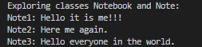
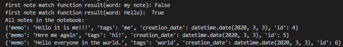
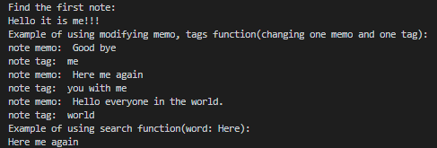
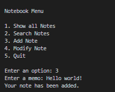
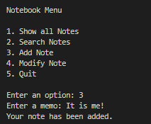
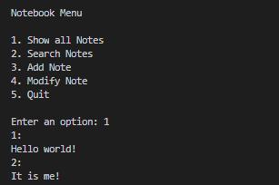

### notebook

This program has two main modules: a notebook and a menu. In the notebook, there are two classes Note and 
Notebook with their own functions. This module is used to make a note and write it down in the notebook. 
The user can use different functions of the notebook. For example, there are functions to create, find and 
update the note. You can also change memo and tags or even search for the notes that contain a certain word. 
In Note, there is a function to determine whether a note matches the filter. Menu class gives you different 
options to choose: 1. Show all Notes; 2. Search Notes; 3. Add Note; 4. Modify Note; 5. Quit.

### Example of modules work

### Notebook: 

### Menu:

### Conclusion
The modules menu and notebook help to make notes and update them or delete when you want. Moreover, there are many different options.

### Author

Khristina Kokolus
